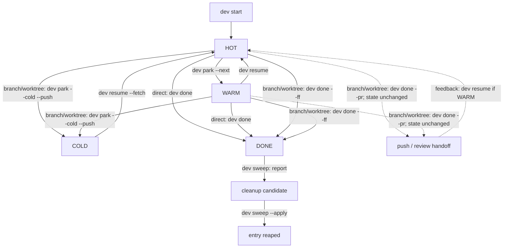

# Mental model and lifecycle

`dev` treats a unit of work as a **change stream** whose durable identity is its Git branch. The checkout and runtime are replaceable projections of that stream.

## Four responsibilities

```text
Git remote + branch  durable history and cross-machine handoff
        ↓
worktree             local files, index, and checked-out HEAD
        ↓
runtime              Herdr workspace, tmux session, or current shell
        ↓
dev registry         human intent and reconstruction metadata
```

The registry stores facts needed to act later: repository and branch identity, base, checkout path, lifecycle state, owner host, next action, notes/tags, runtime handle, optional agent session, and timestamps. Live Git status, ahead/behind, and runtime availability are derived again instead of treated as authoritative cached truth.

## The four lifecycle states

| State | Git and checkout | Runtime | Meaning |
|---|---|---|---|
| 🔥 `hot` | branch plus checkout | open | active now |
| 🌤 `warm` | branch plus checkout kept | closed | likely to return within days |
| ❄️ `cold` | committed and pushed branch; worktree absent | none | paused and reconstructible elsewhere |
| ✅ `done` | integrated | none | retained until cleanup reaps the entry |



For branch/worktree tasks, `dev done --pr` is intentionally not a HOT/WARM → DONE transition. It hands off a pushed branch (opening review when supported) and leaves state and cleanup unchanged; remote merge reconciliation remains manual.

## Checkout modes

A task records intent; it does not always require a linked worktree.

| Mode | Use | Lifecycle limit |
|---|---|---|
| direct | one small change in the canonical checkout | HOT ↔ WARM; canonical checkout cannot be removed |
| branch-only | isolated history without a second directory | can go COLD after push and switching the canonical checkout away |
| worktree | independent mutation, parallel streams, durable feature work | full lifecycle |

The mode is selected by collision and recovery needs, not by ceremony.

## Runtime is deliberately lossy

`runtime.Runtime` exposes `Open`, `Close`, `List`, and `Annotate`. `auto` selects Herdr when available, then tmux, then Zellij, then the always-available `none` backend. Closing any backend must not remove the checkout, branch, or task entry.

This separation is why rebooting, closing a multiplexer, or changing runtime backend does not abandon work. `dev sweep` can compare the registry with live Git/runtime facts and report drift.

## Cross-machine handoff

The branch is the transport boundary:

```bash
# machine A
dev park --cold --push

# machine B
dev resume <task> --fetch
```

One writer owns a branch at a time. If two machines or agents need to mutate the same feature concurrently, split the change stream and integrate afterwards.

## Sources

- [`internal/task/task.go`](https://github.com/daviddwlee84/dev-cli/blob/main/internal/task/task.go)
- [`internal/runtime/runtime.go`](https://github.com/daviddwlee84/dev-cli/blob/main/internal/runtime/runtime.go)
- [`internal/help/topics/parking.md`](https://github.com/daviddwlee84/dev-cli/blob/main/internal/help/topics/parking.md)
- [`internal/cli/done.go`](https://github.com/daviddwlee84/dev-cli/blob/main/internal/cli/done.go)
- [`internal/cli/sweep.go`](https://github.com/daviddwlee84/dev-cli/blob/main/internal/cli/sweep.go)
