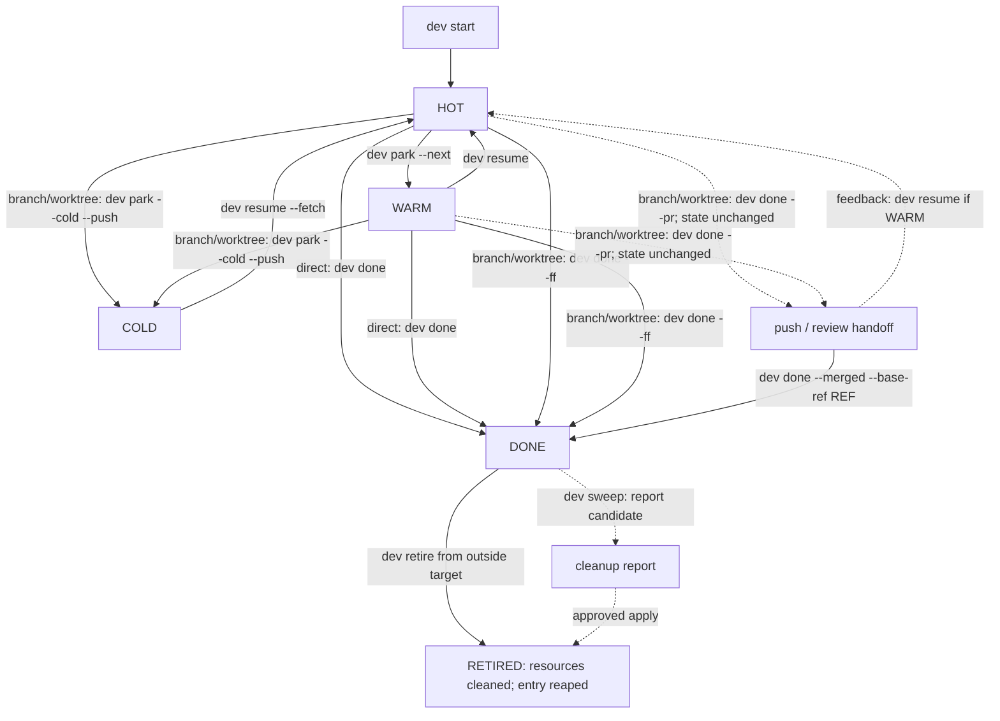

# Mental model and lifecycle

A submodule superproject has several independent Git histories. Workspace member intent links selected child branches to one outer task without adding lifecycle states. See [Submodule workspaces](../guides/submodule-workspaces.md): initialization stays at gitlinks, Cold requires recovery, and Retire also requires child integration.

`dev` treats a unit of work as a **change stream** whose durable identity is its Git branch. The checkout and runtime are replaceable projections of that stream.

## Four responsibilities

```text
Git remote + branch  durable history and cross-machine handoff
        ↓
worktree             local files, index, and checked-out HEAD
        ↓
runtime              Herdr workspace, tmux session, or current shell
        ↓
dev registry         human intent and reconstruction metadata
```

Sidecar state has deliberately separate scopes:

- each task stores checkout mode, repository/branch/base, lifecycle state, owner host, next executable action, task context, runtime hint, and timestamps;
- the catalog stores stable repository/Try identity, tags, one metadata summary, experiment lifecycle, and host-local locations;
- configured `paths.state_dir/notes` stores multiple durable Markdown observations keyed by catalog repository ID;
- `$XDG_CACHE_HOME/dev/notes.db` is only the rebuildable full-text index for those Markdown files.

Machine connection policy has a separate authority boundary. OpenSSH configuration is durable connection truth; dev reads foreign definitions but owns only its exact root Include and canonical `~/.ssh/dev.d` fragments. Fleet intent is the user-authored primary `remotes.toml` merged with explicit generated `remotes.d` registrations. Each remote machine's paths, tasks, repositories, and runtime remain authoritative there; fleet cache is only a controller snapshot.

The catalog ID keeps a quick note attached across linked worktrees, symlink indexes, path moves, and synchronized host state. `dev` does not itself synchronize notes or catalog files. Live Git status, ahead/behind, and runtime availability are derived again instead of treated as authoritative cached truth.

## The four lifecycle states

| State | Git and checkout | Runtime | Meaning |
|---|---|---|---|
| 🔥 `hot` | branch plus checkout | open | active now |
| 🌤 `warm` | branch plus checkout kept | closed | likely to return within days |
| ❄️ `cold` | committed and pushed branch; worktree absent | none | paused and reconstructible elsewhere |
| ✅ `done` | integrated; branch/checkout may remain | may remain open | MERGED, pending explicit retirement |



For branch/worktree tasks, `dev done --pr` is intentionally not a HOT/WARM → DONE transition. It hands off a pushed branch (opening review when supported) and leaves state and cleanup unchanged. `dev flow` can manually query portable review existence/state/draft/URL evidence, but never infers DONE. After an external merge, use `dev done --merged --base-ref <ref>` or Flow's Verify Merged action to prove named ancestry explicitly before a separate Retire plan performs cleanup.

`dev flow [repo]` makes the underlying hybrid model visible: persisted intent,
typed live observations, and a revision-bound guarded plan are distinct. Errors,
unknowns, and stale facts do not become false; Apply revalidates exact task/Git/
worktree/runtime/artifact identity before mutation. See [Repository lifecycle
flow](../guides/repository-flow.md).

## Checkout modes

A task records intent; it does not always require a linked worktree.

| Mode | Use | Lifecycle limit |
|---|---|---|
| direct | one small change in the canonical checkout | HOT ↔ WARM; canonical checkout cannot be removed |
| branch-only | isolated history without a second directory | can go COLD after push and switching the canonical checkout away |
| worktree | independent mutation, parallel streams, durable feature work | full lifecycle |

The mode is selected by collision and recovery needs, not by ceremony.

## Runtime is deliberately lossy

`runtime.Runtime` exposes `Open`, `Close`, `List`, and `Annotate`. `auto` selects Herdr when available, then tmux, then Zellij, then the always-available `none` backend. Closing any backend must not remove the checkout, branch, or task entry.

`none` means no observable multiplexer backend; it does not prove that no session or agent exists. Guarded actions that require occupancy or absence proof retain this as unobserved evidence. `dev flow` never presents it as known closed and does not offer the expert `--assume-no-runtime` override.

This separation is why rebooting, closing a multiplexer, or changing runtime backend does not abandon work. `dev sweep` can compare the registry with live Git/runtime facts and report drift.

## Cross-machine handoff

The branch is the transport boundary:

```bash
# machine A
dev park --cold --push

# machine B
dev resume <task> --fetch
```

One writer owns a branch at a time. If two machines or agents need to mutate the same feature concurrently, split the change stream and integrate afterwards.

## Sources

- [`internal/task/task.go`](https://github.com/daviddwlee84/dev-cli/blob/main/internal/task/task.go)
- [`internal/catalog/catalog.go`](https://github.com/daviddwlee84/dev-cli/blob/main/internal/catalog/catalog.go)
- [`internal/note/note.go`](https://github.com/daviddwlee84/dev-cli/blob/main/internal/note/note.go)
- [`internal/runtime/runtime.go`](https://github.com/daviddwlee84/dev-cli/blob/main/internal/runtime/runtime.go)
- [`internal/help/topics/parking.md`](https://github.com/daviddwlee84/dev-cli/blob/main/internal/help/topics/parking.md)
- [`internal/cli/done.go`](https://github.com/daviddwlee84/dev-cli/blob/main/internal/cli/done.go)
- [`internal/taskflow`](https://github.com/daviddwlee84/dev-cli/tree/main/internal/taskflow)
- [`internal/flowtui`](https://github.com/daviddwlee84/dev-cli/tree/main/internal/flowtui)
- [`internal/cli/sweep.go`](https://github.com/daviddwlee84/dev-cli/blob/main/internal/cli/sweep.go)

A worktree task scopes completion to its own checkout and eligible runtime. Parent agent sessions stay open; FF may still update canonical base files after occupancy checks and any required foreground-program consent. See [retirement scope](../guides/agent-safe-retirement.md#task-worktree-scope).

## Dashboard lifecycle additions

Explicit Try disposal retains catalog identity while the host location becomes `evicted`. Trash and archive both retain bytes; neither is proof of backup or reclaimed space. Task DONE still means integrated work, with retirement separate. See [dashboard actions](../guides/dashboard-actions.md).

## Explicit SSH machine management

`dev ssh manage` compares SSH aliases, fleet profiles and optional Herdr 0.9.0 saved
machines. Existing names stay independent; registration, rename/remove and Herdr
enable/disable are selected actions with a preview. `dev ssh format`, `organize`
and `restore` provide optional guarded local edits and private recovery. Existing
`ssh list` JSON/TSV and fleet snapshot contracts remain compatible. See
[SSH host management](../guides/ssh-hosts.md#machine-management-and-configuration-organization).

## Triage intent

Triage is a view of observed work plus personal review intent. Keep-local, snooze and disposable-directory declarations live outside task lifecycle state. They never turn cached refs into backup proof. [Local triage](../guides/local-triage.md) groups local work before explicit action selection.

## Dashboard navigation and organizer entry

Enter opens a repository/task row or toggles a FLEET host. REPOS/TRY `Ctrl+O` offers organization of the
current item, filtered results, or all local work; multi-selection belongs to the
independent triage screen. `1–7` selects TASKS, REPOS, FLEET, TRY, REMOTE, SKILLS,
and MCP respectively. TASKS state filters live in its action menu (`a` still
shows done tasks). Click a data column for ascending → descending → default
ordering; FLEET HOST groups machines. Sorting is local to each view/session and
uses the current snapshot, with unknown values last. The footer keeps two lines
of primary actions and navigation; tools, state filters and sorting are in
`Ctrl+O`, and `?` lists the full key map. Existing custom tool bindings for `4–7`
need reassignment; `x`/Ctrl+A are no longer reserved dashboard selection keys.

Triage uses grouped repo/Try checkboxes, mouse selection, and Ctrl+A all/none
within the filtered scope. Results preserve failures when returning to the
dashboard. Git synchronization diagnostics retain a category, exit code, bounded
redacted output and a next step; old receipts cannot recover discarded reasons.
Retries require a new preview. Authentication, fetch and rebase are never
silently performed as error recovery. See [local triage](../guides/local-triage.md).


REPOS presentation snapshots and dated skill-source comparisons are regenerable
caches. Native skill locks and installed files remain owned by their existing
management tools. Heatmap Git checkpoints live with activity in stats.db;
clearing caches never clears activity. Cross-repository skills maintenance uses
`dev skill manage`; cached evidence or an available update is not permission to
change files automatically.
