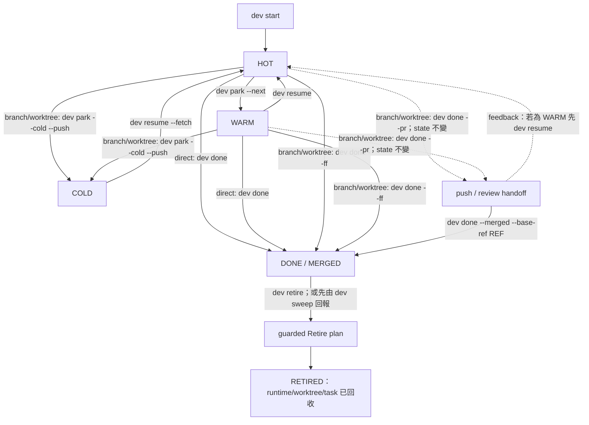

# 心智模型與生命週期

!!! note "術語規則"
    有公認中文譯名且本文使用中文時，首次以「中文 (English original)」呈現。產品名稱與 Git／CLI／agent domain terms 可直接保留英文；沒有公認譯名不得自創。程式碼、API／tool 名稱、CLI flag、套件名與路徑一律不翻譯。

`dev` 把一個工作單位視為變更流 (change stream)，而它的持久身分是 Git branch。Checkout 與執行環境 (runtime) 都只是可替換的投影。

## 四種責任

```text
Git remote + branch  持久 history 與跨機器 handoff
        ↓
worktree             本機 files、index 與 checked-out HEAD
        ↓
runtime              Herdr workspace、tmux session 或目前 shell
        ↓
dev registry         人類意圖與重建 metadata
```

Sidecar state 刻意分成不同 scope：

- 每個 task 保存 checkout mode、repository/branch/base、lifecycle state、owner host、下一個 executable action、task context、runtime hint 與 timestamps；
- catalog 保存穩定的 repository/Try identity、tags、一筆 metadata summary、experiment lifecycle 與 host-local locations；
- configured `paths.state_dir/notes` 保存多筆 durable Markdown observations，並以 catalog repository ID 為 key；
- `$XDG_CACHE_HOME/dev/notes.db` 只是這些 Markdown files 的可重建 full-text index。

Catalog ID 讓 quick note 在 linked worktrees、symlink indexes、path moves 與已同步的 host state 之間維持 attachment。`dev` 本身不會同步 notes 或 catalog files。即時 Git status、ahead/behind 與 runtime availability 會重新推導，不會被當成權威 cache。

## 四個 lifecycle state

| State | Git 與 checkout | Runtime | 意義 |
|---|---|---|---|
| 🔥 `hot` | branch 加 checkout | 開啟 | 正在處理 |
| 🌤 `warm` | 保留 branch 與 checkout | 關閉 | 幾天內會回來 |
| ❄️ `cold` | branch 已 commit、push；worktree 不存在 | 無 | 已暫停，可在別處重建 |
| ✅ `done` | 已具名的整合證據；checkout/branch 可能仍存在 | 可能仍存在 | MERGED，等待獨立 Retire cleanup |



對 branch/worktree task 而言，`dev done --pr` 刻意不是 HOT/WARM → DONE transition。它會 handoff 已 push 的 branch（支援時建立 review），並保留原 state 與 cleanup 狀態。外部 merge 不會被自動推斷；請以 `dev done --merged --base-ref <ref>` 或 `dev flow` 的 Verify Merged action 明確證明 named ancestry，再以獨立 Retire plan cleanup。

## Intent、evidence 與 action readiness

Lifecycle state 只保存人類意圖，不會吸收所有外部事實。`dev flow [repo]` 把三層並列：recorded `HOT/WARM/COLD/DONE` intent、具 freshness 的 Git/runtime/agent/artifact/remote evidence，以及綁定 exact identity 的 guarded plan。`READY` 是某份 plan 的 action readiness；`REVIEW`、`MERGED` 與 `RETIRED` 是 result milestones，皆不是額外 TOML state。UNKNOWN/ERROR evidence 不會被當成 clean、closed 或 absent。完整操作方式見 [Repository Flow 預覽](../guides/repository-flow.zh-TW.md)。

## Checkout mode

Task 記錄的是意圖，不一定要有 linked worktree。

| Mode | 適用情境 | Lifecycle 限制 |
|---|---|---|
| direct | canonical checkout 中的一個小變更 | HOT ↔ WARM；canonical checkout 不能移除 |
| branch-only | 只需要 history isolation，不需要第二個 directory | push 且 canonical checkout 切離後可進 COLD |
| worktree | 獨立寫入、平行 stream、長期 feature | 完整 lifecycle |

選擇 mode 的依據是碰撞與復原需求，不是儀式感。

## Runtime 刻意是可丟失的

`runtime.Runtime` 提供 `Open`、`Close`、`List` 與 `Annotate`。`auto` 會依序選 Herdr、tmux、Zellij，最後使用永遠可用的 `none` backend。關閉任何 backend 都不能移除 checkout、branch 或 task entry。

`none` 只表示沒有可觀察的 multiplexer backend，不等於已證明「沒有 session 或 agent」。需要 occupancy/absence proof 的 guarded action 必須保留 unobserved evidence；`dev flow` 不會把它顯示成已關閉，也不提供 `--assume-no-runtime` expert override。

因此 reboot、關閉 multiplexer 或更換 runtime backend 都不代表放棄工作。`dev sweep` 能比較 registry 與即時 Git/runtime facts 並回報 drift。

## 跨機器 handoff

Branch 是傳輸邊界：

```bash
# machine A
dev park --cold --push

# machine B
dev resume <task> --fetch
```

每個 branch 同時只有一位 writer。若兩台機器或兩個 agent 必須同時修改同一 feature，應拆成不同 change stream，再於之後整合。

## 來源

- [`internal/task/task.go`](https://github.com/daviddwlee84/dev-cli/blob/main/internal/task/task.go)
- [`internal/catalog/catalog.go`](https://github.com/daviddwlee84/dev-cli/blob/main/internal/catalog/catalog.go)
- [`internal/note/note.go`](https://github.com/daviddwlee84/dev-cli/blob/main/internal/note/note.go)
- [`internal/runtime/runtime.go`](https://github.com/daviddwlee84/dev-cli/blob/main/internal/runtime/runtime.go)
- [`internal/help/topics/parking.md`](https://github.com/daviddwlee84/dev-cli/blob/main/internal/help/topics/parking.md)
- [`internal/taskflow/transitions.go`](https://github.com/daviddwlee84/dev-cli/blob/main/internal/taskflow/transitions.go)
- [`internal/cli/flow.go`](https://github.com/daviddwlee84/dev-cli/blob/main/internal/cli/flow.go)
- [`internal/cli/done.go`](https://github.com/daviddwlee84/dev-cli/blob/main/internal/cli/done.go)
- [`internal/cli/retire.go`](https://github.com/daviddwlee84/dev-cli/blob/main/internal/cli/retire.go)
- [`internal/cli/sweep.go`](https://github.com/daviddwlee84/dev-cli/blob/main/internal/cli/sweep.go)
