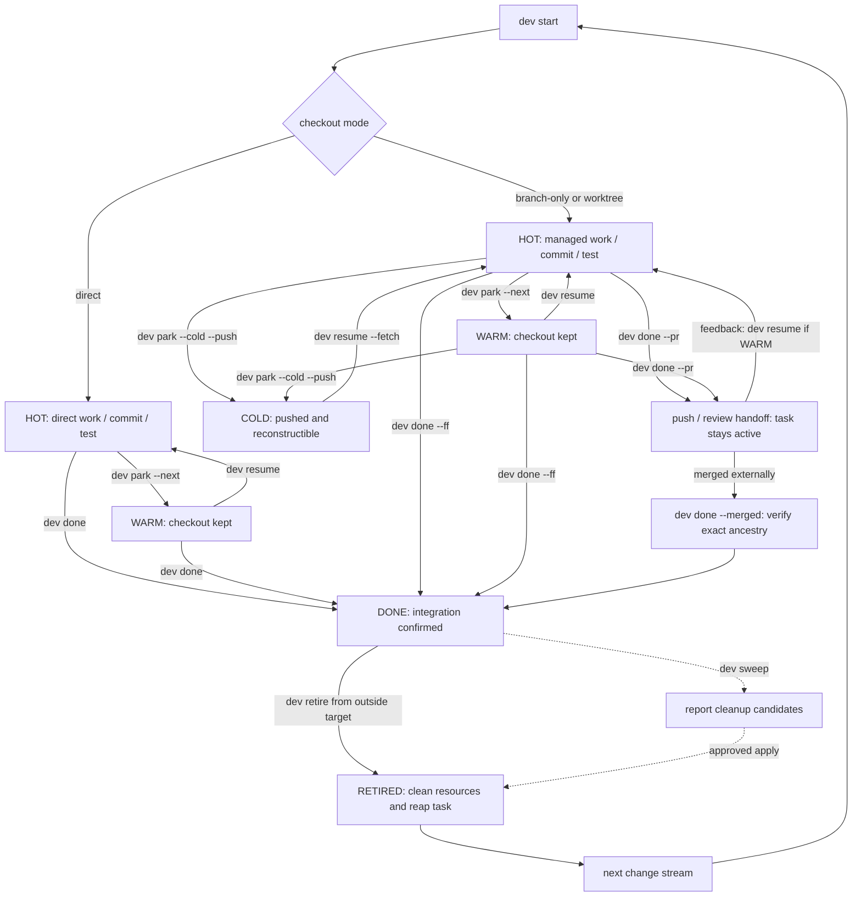

# Change-stream workflow

A `dev` task is a durable record of one line of work. Select the checkout mode, make the branch recoverable, and treat runtime sessions as disposable.

## Lifecycle at a glance



The handoff path deliberately stops at manual reconciliation: `dev done --pr` leaves the task active and may only push when no supported forge CLI is available. `dev flow` can explicitly query run-local review existence/state/draft/URL evidence, but neither it nor `sweep` infers DONE from a forge response. Use `dev done --merged` with exact local ancestry evidence.

## 1. Select the checkout mode

| Mode | Command | Use when |
|---|---|---|
| direct | `dev start <repo> --task <name> --direct` | one small reversible change in the canonical checkout |
| branch-only | `dev start <repo> --task <name> --branch-only --base <ref>` | history isolation is useful but a second directory is not |
| worktree | `dev start <repo> --task <name> --base <ref>` | independent mutation, parallel work, or a stream that may outlive the session |

Worktree mode is the default. If no branch is supplied, `dev` derives `feat/<task-slug>`; automation should still pass the intended base explicitly.

Before changing the canonical checkout in direct or branch-only mode, `dev` guards against sharing it with another active agent/runtime.

## 2. Start and inspect

```bash
dev start api --task "token refresh" --base main --next "reproduce expiry race"
dev ls
dev status
dev flow api   # preview all repository surfaces and exact guarded actions
```

Starting work resolves the repository, validates branch/base, creates or switches the checkout, provisions a worktree when needed, opens the selected runtime, and saves the task. If the branch is already tracked, use `dev resume` instead of creating a duplicate.

## 3. Park intentionally

```bash
dev park --next "add the failing expiry test"
```

The normal transition is HOT → WARM: close the runtime but keep the checkout. Choose the field by scope:

- `--next` is the next executable task action and removes the need to re-derive the first step;
- `dev park --note` preserves free-form context for this one task;
- `dev repo mark --note` replaces the catalog's single repository summary;
- `dev note` stores multiple durable repository observations outside task lifecycle state.

If the tree is dirty:

```bash
dev park --wip --next "finish the expiry test"
```

This creates a temporary `wip: checkpoint — …` commit. It is searchable and pushable; rewrite or squash it before integrating if it is not useful product history.

To release local disk and hand off across machines:

```bash
dev park --cold --push
```

COLD requires recoverable commits on the remote. Direct tasks cannot go cold because the canonical checkout is not disposable.

## 4. Resume from live facts

```bash
dev resume "token refresh" --fetch
```

- WARM: reuse the checkout and reopen the runtime.
- COLD: fetch, recreate the branch/worktree if needed, reprovision, and reopen.
- Work owned by another host: refuse unless ownership has been deliberately transferred or overridden.

Runtime handles are advisory. `dev` re-resolves live sessions instead of assuming a recorded handle still exists.

## 5. Integrate or hand off to review

Preserve meaningful construction commits:

```bash
dev done --ff
```

This requires a clean tree, rebases the task branch onto the base when needed, and runs a fast-forward-only merge in the canonical checkout. It records DONE last while retaining the runtime, worktree, and branch. Run `dev retire` separately from outside the target.

Use review/CI instead:

```bash
dev done --pr
```

This pushes the branch and opens a GitHub pull request or GitLab merge request when the corresponding CLI is available. It **does not** mark the task DONE or clean up the checkout. Current `dev sweep` also does not infer remote request merges, so confirm integration before finishing the local lifecycle.

## The interactive `dev done` finish wizard

Running `dev done` with neither `--ff` nor `--pr` on an interactive terminal opens a finish wizard instead of failing. It never guesses which integration mode you want; it walks the actual state of the checkout and asks only what it cannot infer.

The wizard runs in up to four steps:

1. **Preflight.** It reports the branch, the base, the branch/base commit relation (ahead/behind, or already contained), and — if the checkout is dirty — a path-by-path breakdown of which changes already match the base tree and which are unique.
2. **Dirty changes**, only if the checkout is dirty: `c` commits everything with a message you supply, `d` discards everything (tracked and untracked), `q` cancels with nothing changed. Discarding unique content — anything not already equivalent to the base — requires typing `DROP` at a follow-up confirmation; discarding paths that already match the base does not.
3. **Integration**, only if neither `--ff` nor `--pr` was passed and the branch is not already fully contained in the base: `f` rebases the branch onto the base and fast-forwards it (same as `--ff`), `p` pushes and opens a pull/merge request (same as `--pr`), `q` cancels. When the branch is already contained in the base, the wizard skips this step and can record DONE; cleanup still belongs to `dev retire`.
4. **Cleanup**, only after a managed worktree actually reaches MERGED: `k` keeps runtime/worktree/branch (the default), `r` retires while preserving the branch, and `d` retires and deletes the freshly contained branch. The preview lists covering workspace panes and agent states. Idle/done agents are closeable after confirmation; unknown status needs a separate acknowledgement; active agents and mixed workspaces block cleanup. If the caller is inside the Herdr workspace being retired, dev creates a fresh canonical-checkout coordinator workspace and revalidates every identity there before closing the original workspace.

Passing `--ff` or `--pr` up front answers step 3 and keeps the compatibility behavior: explicit/non-interactive completion does not enter step 4. A final integration summary lists the dirty action and integration mode before anything runs. Cleanup is a separate post-MERGED choice; cancel or EOF there means keep, not rollback. If checkout, branch, task, runtime, or agent evidence changes while either plan is open, dev refuses the stale cleanup and leaves the task DONE.

When interactive fast-forward is blocked before integration, the wizard handles
two narrow recovery cases instead of returning immediately. It can close an
exact non-caller Herdr pane only while the same recognized agent remains
`idle`/`done`; active, blocked, waiting, or unknown status still fails closed.
For a dirty canonical checkout it lists every path and offers PR handoff,
typed-`DROP` discard, or cancel. Canonical discard is part of the guarded
taskflow plan and is revalidated before any rebase or ref movement.

Non-interactively — no TTY, or a script — the wizard never prompts. `dev done` with no integration flag just reports the same preflight and exits; pass `--ff` or `--pr` explicitly. A dirty checkout defaults to failing outside a TTY (`--dirty auto` behaves like `--dirty fail`), so scripts choose an explicit policy:

```bash
dev done --ff --dirty commit -m "chore: finalize before merge"
dev done --pr --dirty discard --yes   # destructive; --yes is mandatory here
```

`--message`/`-m` only applies with `--dirty commit`. `--dirty discard` outside a TTY requires `--yes`; the `DROP` confirmation is an interactive-only safeguard.

## Repository flow preview

Use `dev flow [repo]` when the question is not only “what state is this task?”
but “which exact action is legal for each checkout?” It is a TTY-only interface
independent of the dashboard. It includes every registered worktree plus task-
only COLD/DONE rows, separates observed facts from persisted state, and requires
Enter-to-plan followed by action-specific approval.

Normal managed actions, exact unmanaged metadata-only Adopt/clean branch-
preserving Remove, explicit remote fetch/query, revision revalidation, and
partial result ledgers are described in [Repository lifecycle
flow](repository-flow.md). Flow omits dirty/WIP/shared-writer/takeover/unknown-
runtime overrides; use a blocked plan's CLI fallback when those expert flags are
actually needed.

## 6. Sweep drift and stale state

```bash
dev sweep                 # report only
dev sweep --apply         # confirm each suggested action
dev sweep --apply --yes   # automation after reviewing the report
```

Sweep can propose:

- HOT → WARM when no live session exists;
- old, clean, pushed WARM → COLD;
- removing the registry entry for an already-DONE task;
- clearing a worktree path Git no longer knows;
- reviewing live runtime sessions no task claims.

It never deletes uncommitted work. Reporting first is part of the safety model.

## Recovery rules

- Rebase conflict: resolve it, run `git rebase --continue`, then retry `dev done --ff`; use `git rebase --abort` to return to the pre-rebase state.
- Missing worktree directory: run `dev sweep` or `dev wt rm` to prune stale Git administration, then resume.
- Wrong owner host: verify the other writer has stopped and pushed before using an override.
- Unsure whether work is merged: keep the branch and task; deletion is cheaper after verification than recovery after guessing.

## Sources

- [`internal/cli/start_flow.go`](https://github.com/daviddwlee84/dev-cli/blob/main/internal/cli/start_flow.go)
- [`internal/cli/park.go`](https://github.com/daviddwlee84/dev-cli/blob/main/internal/cli/park.go)
- [`internal/cli/resume.go`](https://github.com/daviddwlee84/dev-cli/blob/main/internal/cli/resume.go)
- [`internal/cli/done.go`](https://github.com/daviddwlee84/dev-cli/blob/main/internal/cli/done.go)
- [`internal/cli/sweep.go`](https://github.com/daviddwlee84/dev-cli/blob/main/internal/cli/sweep.go)
- [`internal/cli/done_flow.go`](https://github.com/daviddwlee84/dev-cli/blob/main/internal/cli/done_flow.go)
- [`internal/taskflow`](https://github.com/daviddwlee84/dev-cli/tree/main/internal/taskflow)
- [`internal/flowtui`](https://github.com/daviddwlee84/dev-cli/tree/main/internal/flowtui)
- [`internal/gitx/finish.go`](https://github.com/daviddwlee84/dev-cli/blob/main/internal/gitx/finish.go)
