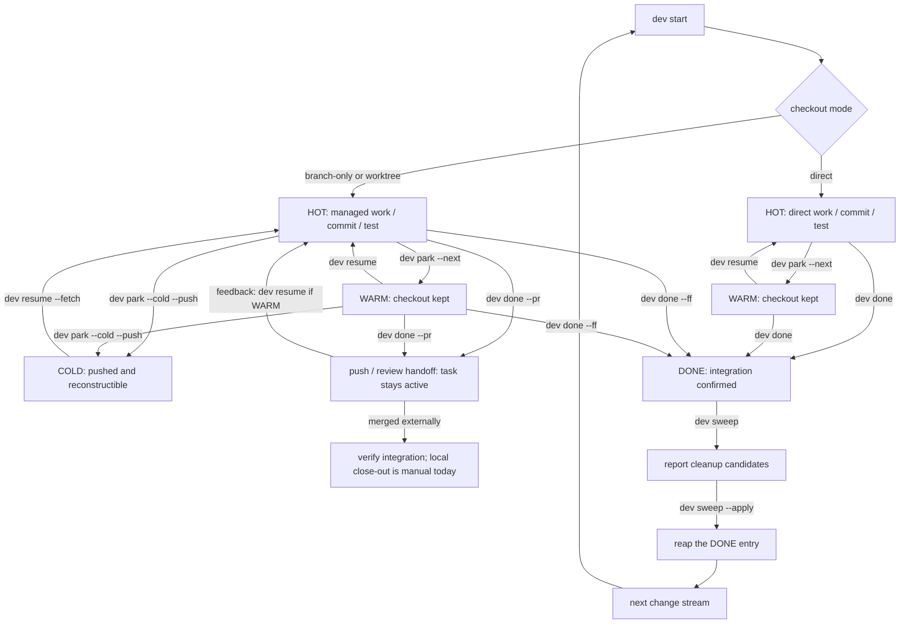

# Change-stream workflow

A `dev` task is a durable record of one line of work. Select the checkout mode, make the branch recoverable, and treat runtime sessions as disposable.

## Lifecycle at a glance



The handoff path deliberately stops at manual reconciliation: `dev done --pr` leaves the task active and may only push when no supported forge CLI is available. `dev` does not currently detect a remote merge or provide a reconciliation-only command that safely marks the task DONE.

## 1. Select the checkout mode

| Mode | Command | Use when |
|---|---|---|
| direct | `dev start <repo> --task <name> --direct` | one small reversible change in the canonical checkout |
| branch-only | `dev start <repo> --task <name> --branch-only --base <ref>` | history isolation is useful but a second directory is not |
| worktree | `dev start <repo> --task <name> --base <ref>` | independent mutation, parallel work, or a stream that may outlive the session |

Worktree mode is the default. If no branch is supplied, `dev` derives `feat/<task-slug>`; automation should still pass the intended base explicitly.

Before changing the canonical checkout in direct or branch-only mode, `dev` guards against sharing it with another active agent/runtime.

## 2. Start and inspect

```bash
dev start api --task "token refresh" --base main --next "reproduce expiry race"
dev ls
dev status
```

Starting work resolves the repository, validates branch/base, creates or switches the checkout, provisions a worktree when needed, opens the selected runtime, and saves the task. If the branch is already tracked, use `dev resume` instead of creating a duplicate.

## 3. Park intentionally

```bash
dev park --next "add the failing expiry test"
```

The normal transition is HOT → WARM: close the runtime but keep the checkout. Choose the field by scope:

- `--next` is the next executable task action and removes the need to re-derive the first step;
- `dev park --note` preserves free-form context for this one task;
- `dev repo mark --note` replaces the catalog's single repository summary;
- `dev note` stores multiple durable repository observations outside task lifecycle state.

If the tree is dirty:

```bash
dev park --wip --next "finish the expiry test"
```

This creates a temporary `wip: checkpoint — …` commit. It is searchable and pushable; rewrite or squash it before integrating if it is not useful product history.

To release local disk and hand off across machines:

```bash
dev park --cold --push
```

COLD requires recoverable commits on the remote. Direct tasks cannot go cold because the canonical checkout is not disposable.

## 4. Resume from live facts

```bash
dev resume "token refresh" --fetch
```

- WARM: reuse the checkout and reopen the runtime.
- COLD: fetch, recreate the branch/worktree if needed, reprovision, and reopen.
- Work owned by another host: refuse unless ownership has been deliberately transferred or overridden.

Runtime handles are advisory. `dev` re-resolves live sessions instead of assuming a recorded handle still exists.

## 5. Integrate or hand off to review

Preserve meaningful construction commits:

```bash
dev done --ff
```

This requires a clean tree, rebases the task branch onto the base, and runs a fast-forward-only merge in the canonical checkout. It then closes the runtime, removes the worktree unless retained, and marks the task DONE.

Use review/CI instead:

```bash
dev done --pr
```

This pushes the branch and opens a GitHub pull request or GitLab merge request when the corresponding CLI is available. It **does not** mark the task DONE or clean up the checkout. Current `dev sweep` also does not infer remote request merges, so confirm integration before finishing the local lifecycle.

## 6. Sweep drift and stale state

```bash
dev sweep                 # report only
dev sweep --apply         # confirm each suggested action
dev sweep --apply --yes   # automation after reviewing the report
```

Sweep can propose:

- HOT → WARM when no live session exists;
- old, clean, pushed WARM → COLD;
- removing the registry entry for an already-DONE task;
- clearing a worktree path Git no longer knows;
- reviewing live runtime sessions no task claims.

It never deletes uncommitted work. Reporting first is part of the safety model.

## Recovery rules

- Rebase conflict: resolve it, run `git rebase --continue`, then retry `dev done --ff`; use `git rebase --abort` to return to the pre-rebase state.
- Missing worktree directory: run `dev sweep` or `dev wt rm` to prune stale Git administration, then resume.
- Wrong owner host: verify the other writer has stopped and pushed before using an override.
- Unsure whether work is merged: keep the branch and task; deletion is cheaper after verification than recovery after guessing.

## Sources

- [`internal/cli/start_flow.go`](https://github.com/daviddwlee84/dev-cli/blob/main/internal/cli/start_flow.go)
- [`internal/cli/park.go`](https://github.com/daviddwlee84/dev-cli/blob/main/internal/cli/park.go)
- [`internal/cli/resume.go`](https://github.com/daviddwlee84/dev-cli/blob/main/internal/cli/resume.go)
- [`internal/cli/done.go`](https://github.com/daviddwlee84/dev-cli/blob/main/internal/cli/done.go)
- [`internal/cli/sweep.go`](https://github.com/daviddwlee84/dev-cli/blob/main/internal/cli/sweep.go)
