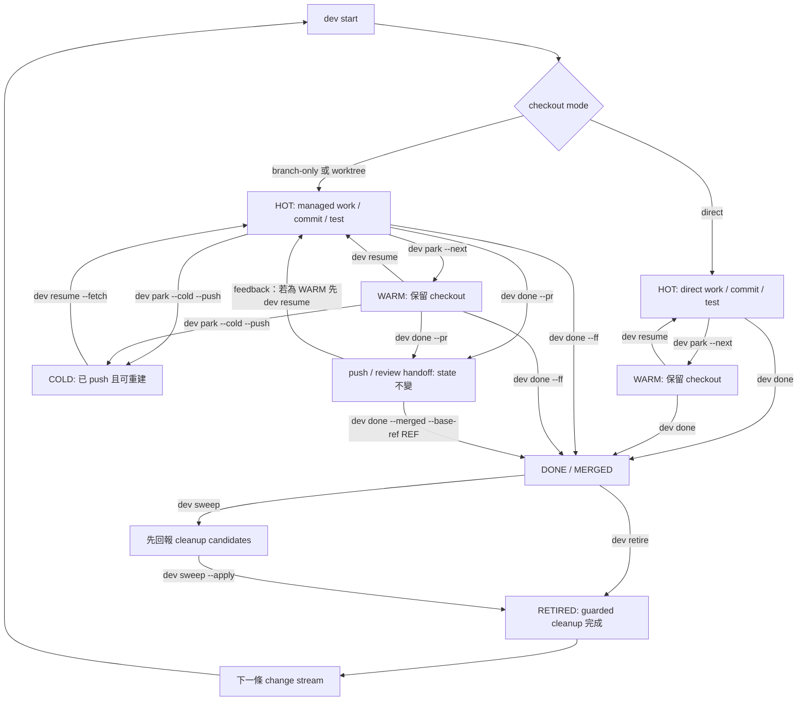

# 變更流工作流程

!!! note "術語規則"
    有公認中文譯名且本文使用中文時，首次以「中文 (English original)」呈現。產品名稱與 Git／CLI／agent domain terms 可直接保留英文；沒有公認譯名不得自創。程式碼、API／tool 名稱、CLI flag、套件名與路徑一律不翻譯。

`dev` task 是一條工作線的持久紀錄。先選 checkout mode、讓 branch 可復原，再把 runtime session 當成可丟棄資源。

## Lifecycle 閉環總覽



Handoff path 刻意保持 state：`dev done --pr` 會讓 task 保持 HOT/WARM；沒有支援的 forge CLI 時也可能只 push。`dev` 不會自動把 provider 的 merged 狀態當成 local DONE。Merge 完成後，以 `dev done --merged --base-ref <ref>` 或 `dev flow` 的 Verify Merged action 驗證 named ancestry；記錄 DONE 之後，再以 Retire 做 cleanup。

## 1. 選擇 checkout mode

| Mode | 命令 | 適用情境 |
|---|---|---|
| direct | `dev start <repo> --task <name> --direct` | canonical checkout 中的一個小型可逆變更 |
| branch-only | `dev start <repo> --task <name> --branch-only --base <ref>` | 需要 history isolation，但不需要第二個 directory |
| worktree | `dev start <repo> --task <name> --base <ref>` | 獨立寫入、平行工作或會比 session 存在更久的變更流 (change stream) |

Worktree 是預設 mode。未指定 branch 時，`dev` 會產生 `feat/<task-slug>`；automation 仍應明確傳入預期 base。

Direct 或 branch-only mode 在修改 canonical checkout 前，`dev` 會防止它與另一個 active agent/runtime 共用。

## 2. Start 與檢查

```bash
dev start api --task "token refresh" --base main --next "reproduce expiry race"
dev ls
dev status
```

Start 會解析 repository、驗證 branch/base、建立或切換 checkout、需要時佈建 worktree、開啟 runtime，再保存 task。Branch 已被追蹤時應使用 `dev resume`，不要建立重複 task。

需要把 intent、目前 Git/runtime/artifact evidence 與可執行 action 並排檢查時，可從 TTY 開啟獨立 preview：

```bash
dev flow              # 目前 checkout 的 canonical repository 與 exact surface
dev flow api          # 明確指定 repository
```

`dev flow` 顯示 Git 註冊的所有 worktrees 與沒有 checkout 的 task-only rows。Enter 只建立 fresh guarded plan；plan 為 READY 且經第二次 approval 後才 Apply。小寫 `r` 只更新 local facts，大寫 `R` 才選擇 fetch refs、query exact PR/MR 或兩者。完整 row/action 與 safety boundary 見 [Repository Flow 預覽](repository-flow.zh-TW.md)。

## 3. 有意識地 park

```bash
dev park --next "add the failing expiry test"
```

一般 transition 是 HOT → WARM：關閉 runtime，但保留 checkout。請依 scope 選擇欄位：

- `--next` 是下一個 executable task action，避免下次重新推導第一步；
- `dev park --note` 保存這一個 task 的 free-form context；
- `dev repo mark --note` 取代 catalog 的單一 repository summary；
- `dev note` 保存多筆 durable repository observations，不屬於 task lifecycle state。

Working tree 尚未乾淨時：

```bash
dev park --wip --next "finish the expiry test"
```

這會建立暫時的 `wip: checkpoint — …` commit。它可搜尋、可 push；若不適合作為 product history，整合前應 reword 或 squash。

需要釋放本機空間並跨機器 handoff 時：

```bash
dev park --cold --push
```

進入 COLD 前，commits 必須已在 remote 上可復原。Direct task 因 canonical checkout 不可丟棄，所以不能進入 COLD。

## 4. 依即時 facts resume

```bash
dev resume "token refresh" --fetch
```

- WARM：重用 checkout 並重新開啟 runtime。
- COLD：fetch，需要時重建 branch/worktree、重新 provision，再開啟 runtime。
- 由另一台 host 擁有：除非已刻意移交或 override ownership，否則拒絕。

Runtime handle 只是 advisory。`dev` 會重新解析 live sessions，不會假設記錄中的 handle 仍存在。

## 5. 整合或交給 review

保留有價值的 construction commits：

```bash
dev done --ff
```

這要求 clean tree，先把 task branch rebase 到 base，再於 canonical checkout 執行 fast-forward-only merge，最後標示 task DONE/MERGED。它不會關閉呼叫端 runtime、移除 worktree 或刪除 branch；請在外部 workspace 另行執行 `dev retire`。

改由 review/CI 處理：

```bash
dev done --pr
```

這會 push branch，並在對應 CLI 可用時建立 pull/merge request。它**不會**標示 task DONE，也不會清理 checkout。`dev sweep` 不會推斷 remote request 已 merge；`dev flow` 的明確 `R` query 也只保留目前 run 的 provider evidence，不會自動 transition。Merge 後請驗證 exact named ref：

```bash
git fetch origin
dev done --merged --base-ref origin/main
dev retire <task> --delete-branch
```

`--merged` 以 ancestry proof 記錄 DONE/MERGED；squash merge 另需 `--confirm-squash <merge-commit>` operator attestation。Review/CI checks、approvals 或 mergeability 不會由最低限度 provider status 推斷。

## 互動式 `dev done` finish wizard

在 interactive terminal 上，省略 `--ff` 與 `--pr` 執行 `dev done` 不會直接失敗，而是開啟 finish wizard。它不會猜你要哪種 integration mode，而是先檢視 checkout 的實際狀態，只詢問它無法推斷的部分。

Wizard 最多分三步：

1. **Preflight。** 回報 branch、base、branch/base 的 commit relation（ahead/behind，或已被 base 包含），以及 — 若 checkout 是 dirty — 逐 path 說明哪些變更已與 base tree 相同、哪些是 unique。
2. **Dirty changes**，僅在 checkout 為 dirty 時出現：`c` 用你輸入的訊息 commit 全部變更，`d` discard 全部（tracked 與 untracked），`q` 取消且不做任何變更。Discard unique content — 尚未與 base 等價的內容 — 需在後續確認時輸入 `DROP`；只 discard 與 base 相符的 path 則不需要。
3. **Integration**，僅在未傳入 `--ff` 或 `--pr`、且 branch 尚未完全被 base 包含時出現：`f` 把 branch rebase 到 base 再 fast-forward（等同 `--ff`），`p` push 並開啟 pull/merge request（等同 `--pr`），`q` 取消。Branch 已被 base 包含時，wizard 會跳過此步驟，直接記錄 DONE/MERGED；runtime/worktree cleanup 仍留給之後的 `dev retire`。

事先傳入 `--ff` 或 `--pr` 等於幫 wizard 回答了第 3 步，因此它只會詢問 flags 未解決的部分 —— 若 tree 乾淨且已明確給出 integration flag，則完全不會詢問。動作執行前會先列出 dirty action 與 integration mode 的摘要；確認它，或在 plan 已由 flags 完全指定時加上 `--yes` 跳過確認。若 plan 開啟期間 checkout 或 branch 發生變化，`dev` 會在確認後偵測到 drift 並拒絕套用過期的 plan —— 重新執行 `dev done` 以取得目前狀態。

Non-interactive 情境 —— 沒有 TTY，或在 script 中 —— wizard 完全不會詢問。未指定 integration flag 時 `dev done` 只會回報同樣的 preflight 後結束；請明確傳入 `--ff` 或 `--pr`。Dirty checkout 在沒有 TTY 時預設失敗（`--dirty auto` 等同 `--dirty fail`），因此 script 應選擇明確的 policy：

```bash
dev done --ff --dirty commit -m "chore: finalize before merge"
dev done --pr --dirty discard --yes   # destructive；此處 --yes 為必要
```

`--message`/`-m` 只在搭配 `--dirty commit` 時使用。`--dirty discard` 在沒有 TTY 時需要 `--yes`；輸入 `DROP` 的確認只存在於 interactive 情境。

## 6. 從外部 Retire

DONE 只代表 MERGED。離開 target checkout/runtime 後再執行：

```bash
dev retire <task>                  # 預設保留 branch
dev retire <task> --delete-branch  # 另行確認 freshly contained branch deletion
```

Retire 會重新確認 caller/agent occupancy、關閉符合條件的 runtime、重新驗證 Git/artifact state、以 non-force 移除 worktree，最後才刪除 DONE task record。任一步驟失敗時保留 ordered ledger 與 recovery；已完成的 effects 不會被假裝 rollback。詳細條件見 [Agent-safe retirement](agent-safe-retirement.zh-TW.md)。

## 7. Sweep drift 與 stale state

```bash
dev sweep                 # 只回報
dev sweep --apply         # 每個建議個別確認
dev sweep --apply --yes   # 已檢查 report 後的 automation
```

Sweep 可建議：

- 沒有 live session 時 HOT → WARM；
- 長時間未動、clean 且已 push 的 WARM → COLD；
- 移除已經 DONE 的 registry entry；
- 清除 Git 不再知道的 worktree path；
- 檢查沒有 task 認領的 live runtime sessions。

它不會刪除 uncommitted work。先回報再動作就是 safety model 的一部分。

## 復原規則

- Rebase conflict：解決後執行 `git rebase --continue`，再重跑 `dev done --ff`；要回到 rebase 前狀態則用 `git rebase --abort`。
- Worktree directory 消失：先用 `dev sweep` 或 `dev wt rm` 清理 stale Git administration，再 resume。
- Owner host 不正確：使用 override 前，先確認另一位 writer 已停止並 push。
- 不確定是否已 merge：保留 branch 與 task；驗證後刪除永遠比猜錯後復原便宜。

## 來源

- [`internal/cli/start_flow.go`](https://github.com/daviddwlee84/dev-cli/blob/main/internal/cli/start_flow.go)
- [`internal/cli/flow.go`](https://github.com/daviddwlee84/dev-cli/blob/main/internal/cli/flow.go)
- [`internal/taskflow`](https://github.com/daviddwlee84/dev-cli/tree/main/internal/taskflow)
- [`internal/cli/park.go`](https://github.com/daviddwlee84/dev-cli/blob/main/internal/cli/park.go)
- [`internal/cli/resume.go`](https://github.com/daviddwlee84/dev-cli/blob/main/internal/cli/resume.go)
- [`internal/cli/done.go`](https://github.com/daviddwlee84/dev-cli/blob/main/internal/cli/done.go)
- [`internal/cli/sweep.go`](https://github.com/daviddwlee84/dev-cli/blob/main/internal/cli/sweep.go)
- [`internal/cli/done_flow.go`](https://github.com/daviddwlee84/dev-cli/blob/main/internal/cli/done_flow.go)
- [`internal/gitx/finish.go`](https://github.com/daviddwlee84/dev-cli/blob/main/internal/gitx/finish.go)
