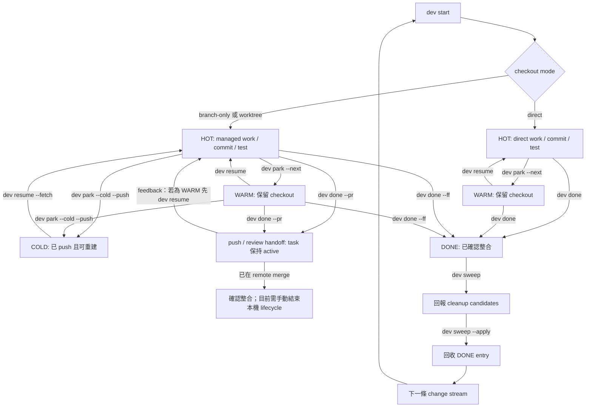

# 變更流工作流程

!!! note "術語規則"
    有公認中文譯名且本文使用中文時，首次以「中文 (English original)」呈現。產品名稱與 Git／CLI／agent domain terms 可直接保留英文；沒有公認譯名不得自創。程式碼、API／tool 名稱、CLI flag、套件名與路徑一律不翻譯。

`dev` task 是一條工作線的持久紀錄。先選 checkout mode、讓 branch 可復原，再把 runtime session 當成可丟棄資源。

## Lifecycle 閉環總覽



Handoff path 刻意停在 manual reconciliation：`dev done --pr` 會讓 task 保持 active；沒有支援的 forge CLI 時也可能只 push。`dev` 目前不會偵測 remote merge，也沒有能安全把 task 標成 DONE 的 reconciliation-only command。

## 1. 選擇 checkout mode

| Mode | 命令 | 適用情境 |
|---|---|---|
| direct | `dev start <repo> --task <name> --direct` | canonical checkout 中的一個小型可逆變更 |
| branch-only | `dev start <repo> --task <name> --branch-only --base <ref>` | 需要 history isolation，但不需要第二個 directory |
| worktree | `dev start <repo> --task <name> --base <ref>` | 獨立寫入、平行工作或會比 session 存在更久的變更流 (change stream) |

Worktree 是預設 mode。未指定 branch 時，`dev` 會產生 `feat/<task-slug>`；automation 仍應明確傳入預期 base。

Direct 或 branch-only mode 在修改 canonical checkout 前，`dev` 會防止它與另一個 active agent/runtime 共用。

## 2. Start 與檢查

```bash
dev start api --task "token refresh" --base main --next "reproduce expiry race"
dev ls
dev status
```

Start 會解析 repository、驗證 branch/base、建立或切換 checkout、需要時佈建 worktree、開啟 runtime，再保存 task。Branch 已被追蹤時應使用 `dev resume`，不要建立重複 task。

## 3. 有意識地 park

```bash
dev park --next "add the failing expiry test"
```

一般 transition 是 HOT → WARM：關閉 runtime，但保留 checkout。具體 `--next` 比很長的 note 更重要，因為它避免下次重新推導第一個動作。

Working tree 尚未乾淨時：

```bash
dev park --wip --next "finish the expiry test"
```

這會建立暫時的 `wip: checkpoint — …` commit。它可搜尋、可 push；若不適合作為 product history，整合前應 reword 或 squash。

需要釋放本機空間並跨機器 handoff 時：

```bash
dev park --cold --push
```

進入 COLD 前，commits 必須已在 remote 上可復原。Direct task 因 canonical checkout 不可丟棄，所以不能進入 COLD。

## 4. 依即時 facts resume

```bash
dev resume "token refresh" --fetch
```

- WARM：重用 checkout 並重新開啟 runtime。
- COLD：fetch，需要時重建 branch/worktree、重新 provision，再開啟 runtime。
- 由另一台 host 擁有：除非已刻意移交或 override ownership，否則拒絕。

Runtime handle 只是 advisory。`dev` 會重新解析 live sessions，不會假設記錄中的 handle 仍存在。

## 5. 整合或交給 review

保留有價值的 construction commits：

```bash
dev done --ff
```

這要求 clean tree，先把 task branch rebase 到 base，再於 canonical checkout 執行 fast-forward-only merge。完成後關閉 runtime、在未要求保留時移除 worktree，並標示 task DONE。

改由 review/CI 處理：

```bash
dev done --pr
```

這會 push branch，並在對應 CLI 可用時建立 GitHub pull request 或 GitLab merge request。它**不會**標示 task DONE，也不會清理 checkout。目前 `dev sweep` 同樣不會推斷 remote request 已 merge，因此必須先確認整合，再結束本機 lifecycle。

## 6. Sweep drift 與 stale state

```bash
dev sweep                 # 只回報
dev sweep --apply         # 每個建議個別確認
dev sweep --apply --yes   # 已檢查 report 後的 automation
```

Sweep 可建議：

- 沒有 live session 時 HOT → WARM；
- 長時間未動、clean 且已 push 的 WARM → COLD；
- 移除已經 DONE 的 registry entry；
- 清除 Git 不再知道的 worktree path；
- 檢查沒有 task 認領的 live runtime sessions。

它不會刪除 uncommitted work。先回報再動作就是 safety model 的一部分。

## 復原規則

- Rebase conflict：解決後執行 `git rebase --continue`，再重跑 `dev done --ff`；要回到 rebase 前狀態則用 `git rebase --abort`。
- Worktree directory 消失：先用 `dev sweep` 或 `dev wt rm` 清理 stale Git administration，再 resume。
- Owner host 不正確：使用 override 前，先確認另一位 writer 已停止並 push。
- 不確定是否已 merge：保留 branch 與 task；驗證後刪除永遠比猜錯後復原便宜。

## 來源

- [`internal/cli/start_flow.go`](https://github.com/daviddwlee84/dev-cli/blob/main/internal/cli/start_flow.go)
- [`internal/cli/park.go`](https://github.com/daviddwlee84/dev-cli/blob/main/internal/cli/park.go)
- [`internal/cli/resume.go`](https://github.com/daviddwlee84/dev-cli/blob/main/internal/cli/resume.go)
- [`internal/cli/done.go`](https://github.com/daviddwlee84/dev-cli/blob/main/internal/cli/done.go)
- [`internal/cli/sweep.go`](https://github.com/daviddwlee84/dev-cli/blob/main/internal/cli/sweep.go)
